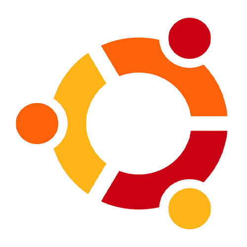

<!---
robertomarkus/robertomarkus is a ✨ special ✨ repository because its `README.md` (this file) appears on your GitHub profile.
You can click the Preview link to take a look at your changes.
--->

<h1 align="left">Hi there,  Welcome to my Github!</h1>

- I’m interested in Software and Hardware Development,especifically in **IoT** Environment  

- Currently learning **Dart, Flutter, Javascript and Python** 

- Looking to collaborate on any developer located in **🇸🇬, 🇮🇩, 🇦🇺** 

- Beside programming I also do great stuff like 2D&3D Graphic &emsp;&nbsp;&nbsp; Design and Video Editing 

- 🤙 Reach me by 📫 <a href="mailto:markusrobertoo@gmail.com">[E-mail]</a>

- ✨ Fun fact **I❤️️🥑** & a Father of Hedgie 🦔

 

## 🛠 &nbsp;Tech Stack

  
  
    
    
  
  
  
  
  
  
  
  
  
  
  
  
  
  
  
  
  
  
  
  
  
  
  
  
  
  
  
  
  

<!--
&nbsp;
&nbsp;
&nbsp;
&nbsp;
&nbsp;
&nbsp;
&nbsp;
&nbsp;
&nbsp;

&nbsp;
&nbsp;
&nbsp;
&nbsp;
&nbsp;
&nbsp;
&nbsp;
&nbsp;
&nbsp;
&nbsp;
&nbsp;
&nbsp;
&nbsp;
&nbsp;
&nbsp;
-->

## ⚙️ &nbsp;GitHub Analytics

 

&nbsp;

<!--  -->

##

  
<!--  -->

 
